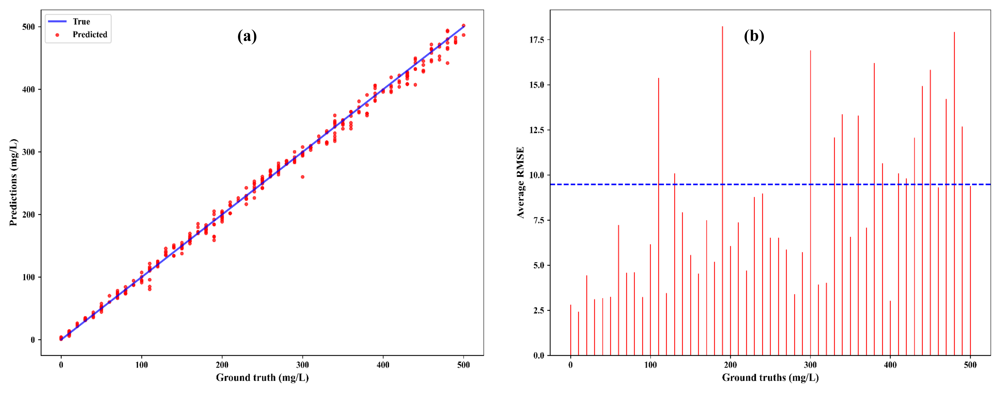
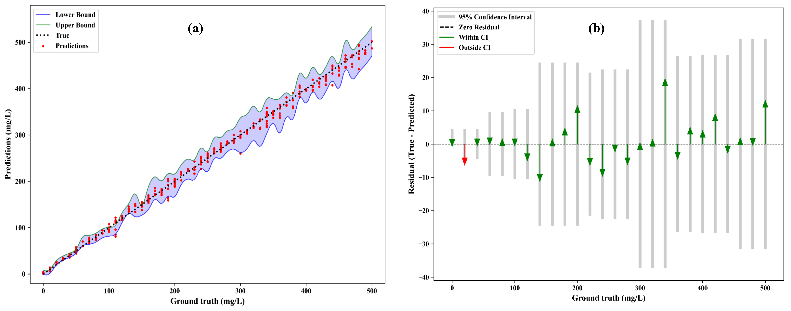

# Real-Time Oil Spill Concentration Assessment through Fluorescence Imaging and Deep Learning
This is the official repository of the paper: _**Real-Time Oil Spill Concentration Assessment through Fluorescence Imaging and Deep Learning**._ This paper presents a pioneering approach to automated oil spill assessment, combining fluorescence imaging with deep learning, and digital platform integration to achieve unprecedented accuracy, accessibility, and efficiency.The system’s ability to provide real-time predictions with meaningful confidence intervals, coupled with its accessibility through mobile and web platforms, makes a significant advancement in environmental monitoring technology. The robust performance of proposed MobileNetV3 based approach across different oil types and concentration ranges, particularly at lower concentrations critical for early detection, establishes this technology as an invaluable tool for environmental protection and emergency response. By integrating the deep learning model into user-friendly platforms, the system ensures real-time field applicability while supporting scalable data management. 

## Overview
Figure below demonstrates the systematic workflow of automated real-time oil spill concentration prediction using our approach. 


## Highlights
- Accurately estimates oil concentration using compact, low-cost imaging and AI tools.
- Mobile and cloud platforms enable rapid, decentralized field assessment.
- Achieved R² = 0.9958 and RMSE = 9.28 on diverse oil spill concentration datasets. 
- Quantifies prediction uncertainty using 95% confidence interval estimation.
- Democratize spill assessment from specialized labs to field operators.

## Model
Our solution combines the power of MobileNetV3 for feature extraction with a robust regression model for oil spill concentration prediction.

1. **Feature Extraction**
   - Utilizes pretrained **MobileNetV3-large** as the backbone network
   - Extracts rich visual features from RGB images
   - Leverages transfer learning for improved feature representation

2. **Concentration Prediction**
   - Implements a **CNN regression model** on top of extracted features
   - Produces three key outputs for each prediction:
     * Lower bound estimate
     * Mean prediction
     * Upper bound estimate
   - Provides confidence intervals for decision support

### Key Benefits
- Lightweight architecture suitable for real-time applications
- Comprehensive prediction range for better risk assessment
- Uncertainty quantification through bound predictions


*Model architecture for oil spill concentration prediction using a pretrained MobileNetV3 and CNN regression. The model takes the fluorescence images and outputs the predicted concentration along with upper and lower interval values.*

## Installation
1. Clone the repository
```bash
git clone https://github.com/biplabpoudel25/Oil-spill-estimation
cd Oil-spill-estimation
```
2. Create and activate conda environment
```bash
conda env create -f environment.yaml
conda activate oil_spill
```

## Make Predictions on Your Own Data
### Data Preparation
Your input data should be organized in a CSV file with two columns:
- `label`: The label(concentration) for each image
- `datapath`: The full path to the corresponding image file

Example CSV format:
```csv
label,datapath
50,/path/to/image1.jpg
200,/path/to/image2.jpg
```

### Step 1: Feature extraction
First, extract deep features from your image dataset using MobileNetV3:
```bash
python extract_deep_features.py --input-dir <path_to_csv> --model <Model Name> --save-name <feature_save_name> --batch_size 1
```

The extracted features will be saved in a dictionary as:
```python
dict = {
    'features': features,  # Deep features from MobileNetV3
    'labels': labels      # Corresponding labels
}
```

### Step 2: Training
Train the CNN regression model on the extracted features:
```bash
python train.py --features-path <path_to_features> --model-name "mobilenetv3" --batch-size 64 --num-epochs 1000 --log-dir <logfile-name> --ckpt-name <checkpoint>
```

The trained model will be saved to ```./checkpoints/..```. 

### Step 3: Testing
Test the trained model on new, unseen data:
```bash
python test.py --features-path <path_to_features> --batch-size 1 --trained-ckpt <trained_checkpoint> --log-dir <logfile-name>
```


## Results

*Performance evaluation of the proposed approach on oil concentration prediction using the test dataset from combined dataset experiment (Experiment 2). (a) Scatter plot comparing predicted concentrations (red dots) with ground truth values (blue line). The x-axis shows the true oil concentrations in mg/L, and the y-axis represents predicted values in mg/L. (b) Bar plot showing RMSE for each ground truth concentration on the test dataset. The x-axis displays true concentration levels (mg/L), and the y-axis shows RMSE values (mg/L). Red bars represent average RMSE at each individual concentration, while the blue dashed horizontal line indicates the average RMSE across the dataset.*


## Confidence interval estimation

*Evaluation of the proposed model’s predictive performance on Experiment 2 using 95 % confidence interval estimation and residual analysis. (a) Confidence interval plot showing predicted concentrations (red dots) along the y-axis against ground truth values on the x-axis (mg/L). The blue line represents the lower bound, the green line represents the upper bound of the 95 % confidence interval, and the blue shaded region denotes the prediction interval. The black dashed line indicates ideal predictions where predicted equals true values. (b) Residual distribution plot showing residuals (true – predicted) on the y-axis against ground truth concentrations (mg/L) on the x-axis. Grey bars represent the width of the 95 % confidence interval at each concentration. Green triangles denote predictions within the confidence interval, while red triangles indicate outliers. The black dashed horizontal line marks zero residuals (perfect prediction baseline).*


## Mobile application interface

*Screenshots of the mobile application interface. (a) Login page: Provides option for user authentication, including login, account creation (Sign Up), and password recovery. (b) Image upload interface: Allows users to upload oil spill images with options for deleting images, editing notes, modifying GPS-based location data, and uploading multiple images simultaneously. Prediction results are also displayed. (c) History interface: Displays a record of all uploaded images, their corresponding predictions, image tags and the uploaded date.*


## Webapp interface

*Web-based interface for the oil spill detection management system demonstrating database integration. (a) Login page: Provides options for user authentication, sign up, and password management. (b) The satellite map view displaying the geographical location of the captured oil spill images. (c) Interface showcasing uploaded images, allowing image upload into the database, and providing filtering options based on date, tags, and notes. Displays detailed metadata, including image ID, GPS coordinates of the image capture, location, prediction results, note, and functionalities for “View in Map”, “Edit Note”, “Edit Tags”, and “Delete Photo”.*


